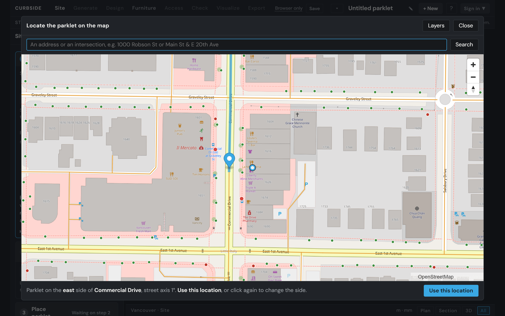
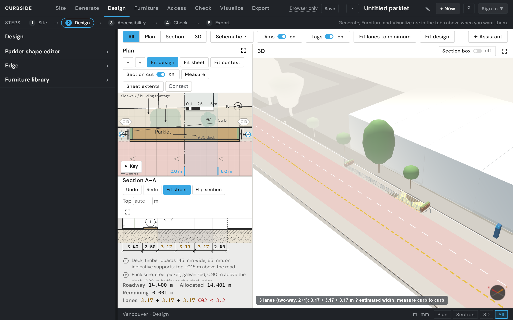
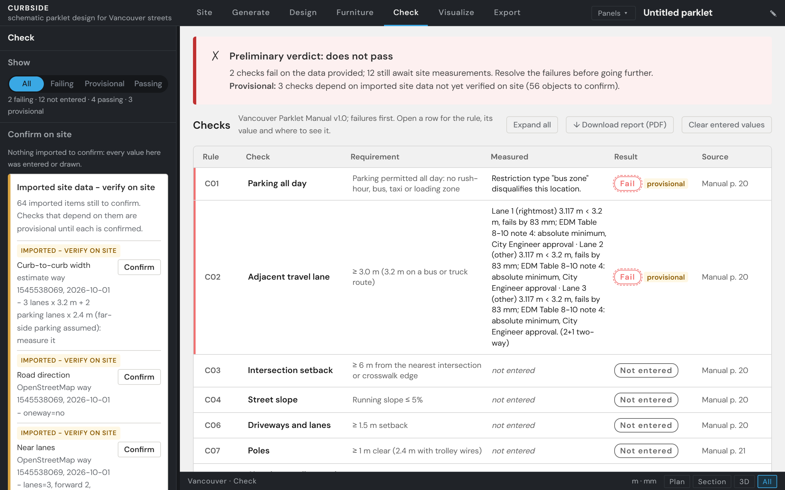
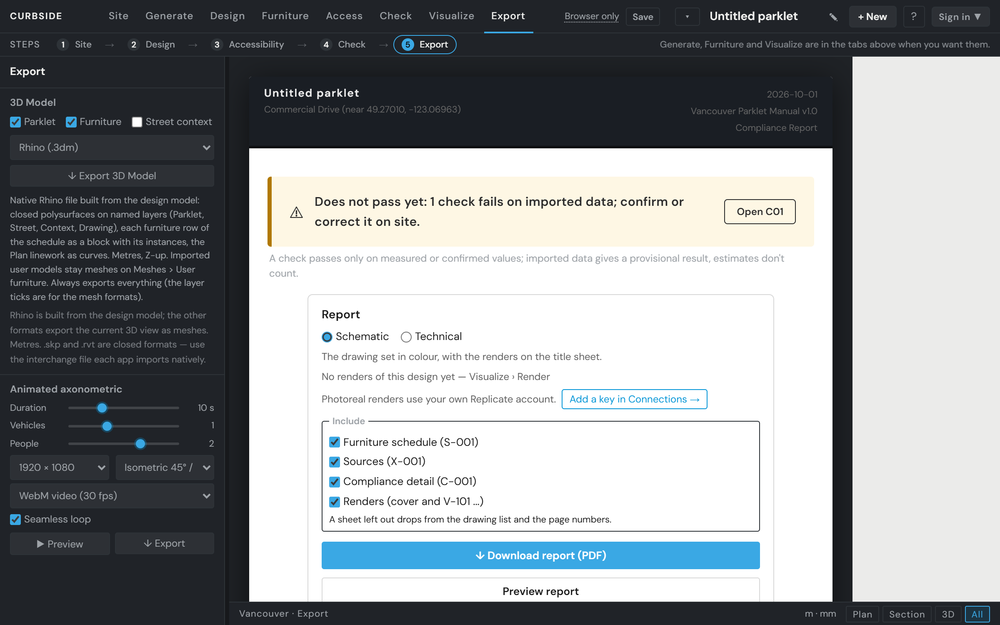

# Curbside

**Use it: <https://jennabruggeman.github.io/curbside/>** · [a sample report](https://jennabruggeman.github.io/curbside/parklet-checker.html?sample=schematic) (no account needed)

Schematic parklet design for Vancouver streets. Draw a parklet on a real street, check it live against the
Vancouver Parklet Manual and the Engineering Design Manual, furnish it, see it in plan, section and 3D, and
export a drawing set.

## Purpose

_To be written by Jenna._

## How to use it

1. **Open the site** at the link above. The landing page shows the four stages and the checks; *See a sample
   report* opens a finished report of a reference design without an account.
2. **Sign in, or create an account.** During the class review (until 9 October 2026) sign-up is open and asks for no
   code; after it, sign-up asks for an invite code. The landing page and the form follow the same setting, so they
   always agree. Signing in lists your designs and opens none. A strip under the tabs shows the four steps,
   Site → Design → Check → Export, until your first export.
3. **Choose a site.** With no site, the drawings show *Choose a site*. Click **Locate on map** and search an address
   *with its house number* (`2000 Main St`) or an intersection (`Main St & E 20th Ave`), or pan to it; click the street,
   then click again on the parklet's side, and **Use this location**. **Layers** on the map shows the site data around
   it: streets, buildings, bikeways, bus stops, hydrants, trees and more. Without a real site, **Start a blank street**
   gives a generic two-way street (one lane each way, parking both sides) to sketch on; its report says it is not a
   real location.
4. **Import street context** (the button in the same panel). It reads the existing street (lanes, direction, route type, bike lane,
   right-of-way width), the buildings and the site objects (hydrants, trees, bus stops) from the site data. Each value
   shows its source and the date of the data; **Override** corrects one. A deck of the default length is then placed at the host frontage.
5. **Design.** In **Design**, shape the deck, set the enclosure on each side (Edge), edit the street in the Section
   (*Add segment*), and place furniture from the Library. Or let **Generate** propose layouts that pass every
   check and **Open in Design** the one you like; where the site itself fails a check no design can fix (a bus zone,
   say), Generate says so and places nothing.
6. **Check.** The **Check** tab gives the verdict in one sentence with one next step (open the failing check, get the
   survey sheet, confirm the imported objects), then every check grouped as Fails · Awaiting measurement · Not entered ·
   Provisional pass · Pass. A check passes only on measured or confirmed values; imported data gives a provisional
   result, and estimates don't count. Imported site objects wait for *Confirm*; values the import cannot know (slope,
   driveways, poles …) are entered here.
7. **Export.** In **Export**, choose Schematic or Technical, tick what to include, and **Download report (PDF)**:
   17 × 11 in sheets, drawings at true scale, the second page *What to do next*. It takes a few seconds (under 20);
   the button fills as it works, sheet by sheet. The 3D model exports as Rhino (.3dm) and other formats.

## Source

Every check cites the page of the City of Vancouver **Parklet Manual, Version 1.0 (June 2016)** it comes from;
travel lanes also use the City's **Engineering Design Manual (2026)**. The same references print on the report's
C-001 and X-001 sheets.

| Check | Requirement | Parklet Manual | Other |
|---|---|---|---|
| C01 | All-day parking permitted (no rush-hour, bus, taxi or loading zone) | p. 20 | |
| C02 | Adjacent travel lane ≥ 3.0 m (3.2 m on bus / truck routes) | p. 20 | EDM Table 8-10, §8.7.3.1, pp. 275–277 |
| C03 | ≥ 6 m from the nearest intersection or crosswalk edge | p. 20 | |
| C04 | Street running slope ≤ 5 % | p. 20 | |
| C05 | ≥ 5 m either side of a fire hydrant | p. 21 | Standard Detail Drawing W4.1 |
| C06 | ≥ 1.5 m from an adjacent driveway or lane | P2, p. 62 | |
| C07 | ≥ 1 m from poles (2.4 m with trolley wires) | p. 21 | Standard Detail Drawing E5.19C |
| C08 | ≥ 2 m from signal controller boxes and electrical kiosks | p. 21 | Standard Detail Drawing E1.3 |
| C09 | ≥ 1 m from manhole lids, valves, grates, access chambers | p. 21 | Standard Detail Drawing WW1 |
| C10 | Fire department and utility connections and fire exits not blocked | p. 21 | |
| C11 | Curb and roadside drainage maintained | p. 21 | |
| C12 | Pedestrian clearances on the boulevard / utility strip maintained | p. 20 | |
| C13 | ≥ 1.5 m from adjacent parking spaces | p. 62 | |
| C14 | Deck flush with the sidewalk (gap ≤ 12 mm, connector ≤ 13 mm) | p. 62 | |
| C15 | Deck load capacity ≥ 7.2 kPa | p. 62 | |
| C16 | Accessible route 1.5 m clear from the sidewalk to an accessible seat; a 1.5 m turning area | G19, p. 60 | |
| C17 | Enclosure 0.75–1.0 m high on the traffic side and both ends | E2, p. 64 | |
| C18 | At least two unobstructed openings of 1.8 m or more to the sidewalk | E3, p. 65 | |
| C19 | Overhead elements ≥ 2.1 m clear above the deck and within the footprint | E5, p. 65 | |

Section numbers for C01–C15 are still to be added from the Manual (the app records their pages). C16 follows the Manual's
G19 (p. 60), 1.5 m, not the BC Building Code's 1.1 m route. Bike lane and buffer widths follow EDM §8.5.4.5. Site data comes from City of Vancouver Open
Data, OpenStreetMap (© OpenStreetMap contributors, ODbL) and TransLink's GTFS feed, prepared weekly in 1 km cells by
[curbside-data](https://github.com/JennaBruggeman/curbside-data); the report's X-001 lists each dataset and the date
of its data.

## One example

Commercial Drive at East 1st Avenue, east side (the images are made by `tools/screenshots.js`; the landing page
shows them too).

| | |
|---|---|
|  |  |
| **Choose a site:** the parklet on the east side of Commercial Drive, between Graveley Street and East 1st Avenue. | **Seed the parklet:** a 19.8 × 2.65 m deck at the host frontage (Liberty Wine Merchants), with its enclosure. |
|  |  |
| **Design and check:** with seven pieces placed, the preliminary verdict is *does not pass*: C01 fails (a bus stop beside the deck makes it a bus zone) and C02 fails (three lanes of 3.12 m on a bus route, where 3.2 m is required); 12 checks await site measurements. | **Report:** the drawing set, with the options to include or leave out the schedule, the sources, the compliance detail and the renders. |

A recorded walkthrough of the whole journey is planned (Brief 26).

## Skill and limits

- **Schematic, not construction.** The drawings are for the Parklet Manual pre-application; no structural or
  construction feasibility is assessed.
- **Imported data is a starting point.** Street facts, buildings and site objects come from City open data and
  OpenStreetMap. Curb-to-curb width is an estimate to measure, and every imported object stays *provisional* until
  confirmed on site.
- **Checks need inputs.** A check whose value is neither imported nor entered reports *not entered*, never a pass.
- **Vancouver only**, and a desktop browser with WebGL.
- **Photoreal renders and the Design Assistant use the visitor's own keys** (Replicate, Anthropic), entered in
  Settings › Connections and kept only in that browser. The site ships with none.
- **The render relay is absent on the Pages build.** Photoreal renders go through the relay in `tools/serve.ps1`,
  which only exists when you run the app locally; on the hosted site Visualize says so, and everything else works.
- Site data is rebuilt weekly, so it can be a week behind OpenStreetMap. **live** in the Layers tab refreshes an
  OpenStreetMap layer on the map; the site's values change at the next import. Outside the City of Vancouver there is
  no site data: the import then runs on estimates.

---

## Run it locally

1. Clone the repository.
2. Windows: double-click `tools\start.cmd`. It starts the local server (`tools/serve.ps1`, PowerShell 5.1, no
   other install) on <http://localhost:8766/> and opens the landing page. `tools\stop.cmd` stops it.
   Any static web server also works for everything except photoreal renders, which go through the relay in
   `tools/serve.ps1`.
3. Enable the repository's pre-push check once: `git config core.hooksPath tools/hooks` (it refuses PDF, DWG
   and ZIP files and anything over 5 MB).

## Developer prerequisites

Running the app needs none of this. The developer scripts in `tools/` (the landing-page screenshots and the city
data build) need:

- **Node.js 24 LTS or later** — <https://nodejs.org/> (the Windows installer, or the portable `win-x64` zip).
  Check with `node --version`.
- **Playwright 1.63.0** (pinned in `tools/package.json`) and its Chromium:

  ```
  cd tools
  npm install
  npx playwright install chromium
  ```

  `npm install` fetches Playwright into `tools/node_modules` (git-ignored); the second command downloads its
  Chromium, headless shell and ffmpeg (for recorded video) into Playwright's user cache, about 150 MB.

`node tools/screenshots.js` redraws the landing images from the recorded site data in `tools/fixtures/`
(`--record` fetches it again).

## Add your keys (optional)

Settings (account menu) › **Connections**. Each row has a key field, **Test** (one free call that says whether
the key works) and **Remove**. Keys are stored only in this browser, never sent to Curbside's servers and never
saved with a design, an export or a log.

| Service | Used for | Get a key | Pricing |
|---|---|---|---|
| Replicate | Photoreal renders (Visualize › Photoreal; local server only) | <https://replicate.com/account/api-tokens> | <https://replicate.com/pricing> |
| Anthropic | The Design Assistant; reading furniture cut sheets | <https://console.anthropic.com/settings/keys> | <https://www.anthropic.com/pricing#api> |
| Mapillary | Street context photos for renders | <https://www.mapillary.com/dashboard/developers> | free |

Without a key the feature says so and links to Connections; everything else works.

How the keys travel: the Anthropic key goes from the browser straight to Anthropic. The Replicate key is sent
with each render request to the local relay (`tools/serve.ps1`), which forwards it to Replicate for that one
request; the relay never stores or logs keys, headers or bodies, and only calls the models on its allow-list.

## Your own backend

Accounts and saved designs use [Supabase](https://supabase.com). To run your own copy without touching anyone
else's data:

1. Create a free Supabase project.
2. In its SQL Editor, run [`supabase/schema.sql`](supabase/schema.sql). It creates the `profiles` and `designs`
   tables, turns on Row Level Security for every table (each user reads and writes only their own rows; a
   signed-out request reads nothing), the invite check, and the private `user-furniture` storage bucket.
3. Run [`supabase/invite-codes.sql`](supabase/invite-codes.sql) for one invite code per person (see below), and
   [`supabase/invite-status.sql`](supabase/invite-status.sql) if your database was set up before it was part of `schema.sql`.
4. Project Settings › API: copy the **Project URL** and the **anon / publishable key** into the `CONFIG` block at
   the top of `parklet-checker.html`. Only the anon key belongs there — never the service-role key or a
   database password.
5. Authentication › URL Configuration: set the Site URL to your site's address and add it to the Redirect URLs.

### Invite-only sign-up

Sign-up asks for an invite code, checked by the database when the account is created (never in the page). With
`invite-codes.sql`, each code has a label, a number of uses (one by default) and an optional expiry:

```sql
insert into public.invite_codes (code, label, expires_at)
select upper(encode(gen_random_bytes(5), 'hex')), 'Reviewer ' || g, now() + interval '30 days'
from generate_series(1, 3) g
returning code, label, expires_at;                                  -- three codes, one account each

select code, label, uses, last_used_at from public.invite_codes;    -- which were used
update public.app_settings set invite_only = false;                 -- open sign-up to anyone
```

The landing page's "invite code required" line and the sign-up form's code field follow `app_settings.invite_only`, read
through `public.signup_invite_only()` (`invite-status.sql`: the yes / no flag only, never the code), so the one-line
toggle above is all it takes. `CONFIG.INVITE_ONLY` is only the form's fallback when that function cannot be reached. Set
`CONFIG.INVITE_CONTACT` to whoever hands out codes. Existing accounts are never affected.

## Repository

- `parklet-checker.html` — the app (one file). `index.html` — the landing page (the site's root).
- `tools/` — the local server and relay, start/stop scripts, bundled report libraries (`tools/vendor`), the
  pre-push check (`tools/hooks`), and the Node developer scripts (`tools/package.json`).
- `supabase/` — the database and its security policies; the invite codes.
- `demo/` — the sample design and its renders (rendered with the author's Replicate account).
- `landing/` — the landing page's images; `tools/fixtures/` — the site data they are drawn from.
- `briefs/` — the design briefs.

Third-party reference documents (the City's manuals and drawings, manufacturer catalogues, precedent images)
are not in this repository: keep local copies in `reference/`, which is git-ignored.

## Licence

MIT (see [`LICENSE`](LICENSE)). Third-party components and data: [`THIRD_PARTY.md`](THIRD_PARTY.md).
