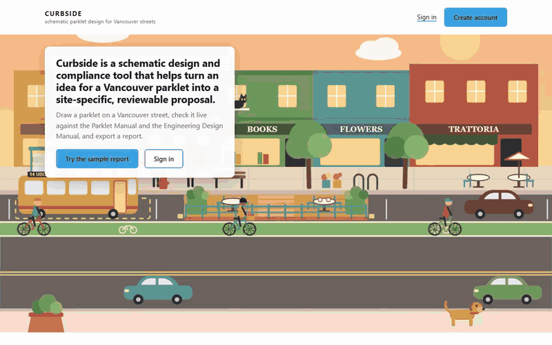

# Curbside

**Use it: <https://jennabruggeman.github.io/curbside/>** · [a sample report](https://jennabruggeman.github.io/curbside/demo/sample-technical.pdf) (the technical set, PDF; no account needed)

Schematic parklet design for Vancouver streets. Draw a parklet on a real street, check it live against the
Vancouver Parklet Manual and the Engineering Design Manual, furnish it, see it in plan, section and 3D, and
export a drawing set.

## Purpose

Curbside is a schematic design and compliance tool that helps turn an idea for a Vancouver parklet into a site-specific, reviewable proposal. Designed for anyone who might initiate a parklet, from a café owner to a designer preparing a first sketch, it builds the street from the address using City open data, OpenStreetMap and TransLink, incorporating lanes, bike routes, transit stops, hydrants, trees and buildings. Users can generate and refine furnished layouts according to their priorities, such as seating, planting or shade, while the Parklet Manual's clearance and access requirements are checked throughout. Each value is identified as measured, imported or estimated; estimates cannot satisfy compliance checks, and a survey sheet lists what must still be verified on site. From one model, Curbside produces both a schematic package for communicating the proposal and a technical package documenting compliance, assumptions and sources for pre-application review.

## How to use it

Curbside runs in the browser at the link above. Nothing to install. Button and tab names below are shown *in italics* exactly as they appear on screen.

### 1. Open the site

Open the link above. The landing page explains the steps. *Try the sample report* opens a finished technical report for a reference design; no account is needed for that.

### 2. Sign in

Click *Sign in*, or *Create account*. During the class review (until 9 October 2026) sign-up is open and asks for no invite code. After signing in, your most recent design opens.

- **Your designs:** open the account menu (*your name ▼*) and choose *My designs* to see the rest. Each has *Open*, *Rename* and *Delete*.
- **Saving:** every change saves itself. *Save* saves at once. The bar in the header reads *Saved ·* and the time; signed out, it reads *Browser only*, meaning the design lives only in this browser.

### 3. Choose a site

Click *Locate on map* and search an address with its house number (`2000 Main St`) or an intersection (`Main St & E 20th Ave`). Pick a result, click the street, then click the parklet's side of it, and click *Use this location*.

- *Layers* on the map shows what the import will read: streets, buildings, bikeways, bus stops, hydrants, trees.
- No real site? *Start a blank street* gives a generic two-way street to sketch on; its report says it is not a real location.
- If you locate a different street, side or block later, the tool asks *Replace the site data?* Replacing clears the imported data and site values; the deck and furniture stay.

### 4. Import

Click *Import street context*. The tool reads the street (lanes, direction, route type, bike lane), the buildings, and the site objects (hydrants, trees, bus stops) within 150 m, from City of Vancouver open data, OpenStreetMap and TransLink. It then places a 19.8 m deck at the host building's frontage (*Place parklet*).

- Every value shows where it came from: *imported*, *estimate*, or *You* once you have typed it.
- To change a value or a step, click *Edit* on that step.

### 5. Design

Work in the *Design* tab, in *Plan*, *Section* or *3D*.

- **Add a piece:** open the *Furniture* tab, click *Place on deck* on a card, then click a spot on the deck. Enter places it at the centre; Esc cancels.
- **Move a piece:** drag it on the Plan. It never leaves the deck; the edge it meets flashes. Or use the *Move* arrows (0.25 m steps), the keyboard arrow keys, or type *Across* / *Along* and *Apply*. *Duplicate* and *Delete* are under *Actions*.
- **Your own furniture:** *Import 3D model…* (Furniture tab or library) → *Choose a file…* (GLB, glTF or OBJ) → *Add to My furniture*. It joins the library in this browser.
- **Deck shape:** *Parklet shape editor* → *Edit the deck's shape*: *Rectangle*, *Polygon*, *Edit*, *Notch* or *Reset to rectangle*, then *Apply* (*Cancel* discards).
- **Enclosure:** *Edge*. Choose *Traffic side*, *Start end* or *Far end*, then an enclosure type (*Steel picket*, *Planter wall* …), its *Height*, *Buffer* and *Material*.
- **Street:** in the *Section*, drag a chip from *Add segment* (*Bike Lane*, *Planting* …) into the section. It is refused, with the reason, when the roadway has no room. Click a width to type it; a typed width counts as measured.
- **Undo:** Ctrl+Z works in the Section and in the shape editor. A furniture move has no undo; move it back.
- **Generate:** proposes layouts from *Site constraints*, *Programme* (each use weighted 0–3), *Character and materials* and *Output* (*Schemes*, *Seed*). If a site fact is missing, it says *Set these site facts first* with a link to the first one, and the button stays. *Lock* keeps a scheme through *Regenerate*; *Open in Design* takes it into your design.

### 6. Accessibility

The *Access* tab checks a 1.5 m clear route from each entry to an accessible seat (a bench end, or a table 0.70–0.80 m high). Drag a piece on the Plan and the route follows; it shows where a piece blocks it and by how much.

### 7. Check

The *Check* tab gives the verdict in one sentence with one next step, then every check grouped under *Fails*, *Awaiting measurement*, *Not entered*, *Provisional pass* and *Pass*.

A check passes only on measured or confirmed values. Imported data gives a provisional result. Estimates never pass.

- **Enter a value:** open a group, open the row, type the number. It reads *Not saved yet* until you click *Save* (or press Enter); Esc discards. The row then moves to its new group.
- **Confirm imported objects:** *Confirm imported items* opens the list; *Confirm* per group, or *Confirm all visible* once you have checked them on site.
- **See it on the drawing:** *Show me in the Plan ›* in any open row.
- **Site survey (optional):** *Site › Survey › Survey template (CSV)* downloads a sheet of the values to measure; fill its measured column and *Import filled template…*.

### 8. Export

In *Report*, choose *Schematic* (colour, renders on the title sheet) or *Technical* (line and hatch, no images), tick what to *Include*, and click *Download report (PDF)*. It takes a few seconds; page two is *What to do next*.

- **3D model:** *3D Model* → *Rhino (.3dm)* (or glTF, IFC, Collada, STL, OBJ, DXF) → *Export 3D Model*.

### 9. Settings

Open the account menu (*Sign in ▼* or *your name ▼*) → *Settings*.

- **Connections:** your own Replicate key for photoreal renders, Anthropic key for the Design Assistant, and Mapillary token for street photos. Paste a key and press Enter; *Test* checks it, *Remove* deletes it. Keys are stored only in this browser, never sent to Curbside's servers or saved with your design. On the hosted copy, renders also need the local server (`tools/start.cmd`); *how?* beside *Render (photoreal, 4 presets)* explains.
- **General** (name, email, organization, kept in this browser), **Units** (Metric / Imperial), **Grid & Snap**, **Project North** (*Set in Site*), **Data** (*Clear all saved data*).
- **Sign out** is in the account menu; it saves the open design first.

## Source

Every check cites the page of the City of Vancouver **Parklet Manual, Version 1.0 (June 2016)** it comes from;
travel lanes also use the City's **Engineering Design Manual (2026)**. The same references print on the report's
C-001 and X-001 sheets.

| Check | Requirement | Parklet Manual | Other |
|---|---|---|---|
| C01 | All-day parking permitted (no rush-hour, bus, taxi or loading zone) | p. 20 | |
| C02 | Adjacent travel lane ≥ 3.0 m (3.2 m on bus / truck routes) | p. 20 | EDM Table 8-10, §8.7.3.1, pp. 275–277 |
| C03 | ≥ 6 m from the nearest intersection or crosswalk edge | p. 20 | |
| C04 | Street running slope ≤ 5 % | p. 20 | |
| C05 | ≥ 5 m either side of a fire hydrant | p. 21 | Standard Detail Drawing W4.1 |
| C06 | ≥ 1.5 m from an adjacent driveway or lane | P2, p. 62 | |
| C07 | ≥ 1 m from poles (2.4 m with trolley wires) | p. 21 | Standard Detail Drawing E5.19C |
| C08 | ≥ 2 m from signal controller boxes and electrical kiosks | p. 21 | Standard Detail Drawing E1.3 |
| C09 | ≥ 1 m from manhole lids, valves, grates, access chambers | p. 21 | Standard Detail Drawing WW1 |
| C10 | Fire department and utility connections and fire exits not blocked | p. 21 | |
| C11 | Curb and roadside drainage maintained | p. 21 | |
| C12 | Pedestrian clearances on the boulevard / utility strip maintained | p. 20 | |
| C13 | ≥ 1.5 m from adjacent parking spaces | p. 62 | |
| C14 | Deck flush with the sidewalk (gap ≤ 12 mm, connector ≤ 13 mm) | p. 62 | |
| C15 | Deck load capacity ≥ 7.2 kPa | p. 62 | |
| C16 | Accessible route 1.5 m clear from the sidewalk to an accessible seat; a 1.5 m turning area | G19, p. 60 | |
| C17 | Enclosure 0.75–1.0 m high on the traffic side and both ends | E2, p. 64 | |
| C18 | At least two unobstructed openings of 1.8 m or more to the sidewalk | E3, p. 65 | |
| C19 | Overhead elements ≥ 2.1 m clear above the deck and within the footprint | E5, p. 65 | |

Section numbers for C01–C15 are still to be added from the Manual (the app records their pages). C16 follows the Manual's
G19 (p. 60), 1.5 m, not the BC Building Code's 1.1 m route. Bike lane and buffer widths follow EDM §8.5.4.5. Site data comes from City of Vancouver Open
Data, OpenStreetMap (© OpenStreetMap contributors, ODbL) and TransLink's GTFS feed, prepared weekly in 1 km cells by
[curbside-data](https://github.com/JennaBruggeman/curbside-data); the report's X-001 lists each dataset and the date
of its data.

## One example



Ninety seconds on the live site, captions and no sound ([MP4](demo/walkthrough.mp4)): Main Street at East 26th Avenue
located and imported, the curb-to-curb estimate, Generate refusing until the site facts are set; a saved design (West
Georgia Street) opened from My designs, generated and opened in Design; one Check value saved; the technical report
downloaded and paged through: cover, What to do next, layout plan, deck plan, both sections, C-001 and sources.

## Skill and limits

- **Schematic, not construction.** The drawings are for the Parklet Manual pre-application; no structural or
  construction feasibility is assessed.
- **Imported data is a starting point.** Street facts, buildings and site objects come from City open data and
  OpenStreetMap. Curb-to-curb width is an estimate to measure, and every imported object stays *provisional* until
  confirmed on site.
- **Checks need inputs.** A check whose value is neither imported nor entered reports *not entered*, never a pass.
- **Vancouver only**, and a desktop browser with WebGL.
- **Open a design in one tab at a time; the last save wins.** Two tabs on the same design do not merge: whichever
  saves last replaces the other's edits.
- **Photoreal renders and the Design Assistant use the visitor's own keys** (Replicate, Anthropic), entered in
  Settings › Connections and kept only in that browser. The site ships with none.
- **The render relay is absent on the Pages build.** Photoreal renders go through the relay in `tools/serve.ps1`,
  which only exists when you run the app locally; on the hosted site Visualize says so, and everything else works.
- Site data is rebuilt weekly, so it can be a week behind OpenStreetMap. **live** in the Layers tab refreshes an
  OpenStreetMap layer on the map; the site's values change at the next import. Outside the City of Vancouver there is
  no site data: the import then runs on estimates.

---

## Run it locally

1. Clone the repository.
2. Windows: double-click `tools\start.cmd`. It starts the local server (`tools/serve.ps1`, PowerShell 5.1, no
   other install) on <http://localhost:8766/> and opens the landing page. `tools\stop.cmd` stops it.
   Any static web server also works for everything except photoreal renders, which go through the relay in
   `tools/serve.ps1`.
3. Enable the repository's pre-push check once: `git config core.hooksPath tools/hooks` (it refuses PDF, DWG
   and ZIP files and anything over 5 MB; the exceptions are the two sample reports below and the README's walkthrough clip,
   `demo/walkthrough.gif` and `.mp4`, which may be up to 10 MB).

## Developer prerequisites

Running the app needs none of this. The developer scripts in `tools/` (the landing-page screenshots and the city
data build) need:

- **Node.js 24 LTS or later** — <https://nodejs.org/> (the Windows installer, or the portable `win-x64` zip).
  Check with `node --version`.
- **Playwright 1.63.0** (pinned in `tools/package.json`) and its Chromium:

  ```
  cd tools
  npm install
  npx playwright install chromium
  ```

  `npm install` fetches Playwright into `tools/node_modules` (git-ignored); the second command downloads its
  Chromium, headless shell and ffmpeg (for recorded video) into Playwright's user cache, about 150 MB.

`node tools/screenshots.js` redraws the landing images from the recorded site data in `tools/fixtures/`
(`--record` fetches it again).

`node tools/build-sample-pdfs.js` rebuilds the two sample reports (`demo/sample-schematic.pdf` and
`demo/sample-technical.pdf`, with their counts in the matching `.json`) from `demo/sample-design.json`, with the
local server running. Run it after any change to the report or to the sample design: `sample.html` shows these files
as they are (without them it builds the sample in the browser, which takes several seconds).

`node tools/bump-version.js v0.17` bumps the version in one step, with the local server running. It sets the
sheets' stamp in `parklet-checker.html` and the landing page's version, then rebuilds both sample reports at that
version. The pre-push hook refuses a push whose sample reports carry a different version from the app.

## Add your keys (optional)

Settings (account menu) › **Connections**. Each row has a key field, **Test** (one free call that says whether
the key works) and **Remove**. Keys are stored only in this browser, never sent to Curbside's servers and never
saved with a design, an export or a log.

| Service | Used for | Get a key | Pricing |
|---|---|---|---|
| Replicate | Photoreal renders (Visualize › Photoreal; local server only) | <https://replicate.com/account/api-tokens> | <https://replicate.com/pricing> |
| Anthropic | The Design Assistant; reading furniture cut sheets | <https://console.anthropic.com/settings/keys> | <https://www.anthropic.com/pricing#api> |
| Mapillary | Street context photos for renders | <https://www.mapillary.com/dashboard/developers> | free |

Without a key the feature says so and links to Connections; everything else works.

How the keys travel: the Anthropic key goes from the browser straight to Anthropic. The Replicate key is sent
with each render request to the local relay (`tools/serve.ps1`), which forwards it to Replicate for that one
request; the relay never stores or logs keys, headers or bodies, and only calls the models on its allow-list.

## Your own backend

Accounts and saved designs use [Supabase](https://supabase.com). To run your own copy without touching anyone
else's data:

1. Create a free Supabase project.
2. In its SQL Editor, run [`supabase/schema.sql`](supabase/schema.sql). It creates the `profiles` and `designs`
   tables, turns on Row Level Security for every table (each user reads and writes only their own rows; a
   signed-out request reads nothing), the invite check, and the private `user-furniture` and `design-renders` storage
   buckets (one folder per user: your imported furniture, and each design's render gallery).
3. Run [`supabase/invite-codes.sql`](supabase/invite-codes.sql) for one invite code per person (see below), and
   [`supabase/invite-status.sql`](supabase/invite-status.sql) if your database was set up before it was part of `schema.sql`.
4. Project Settings › API: copy the **Project URL** and the **anon / publishable key** into the `CONFIG` block at
   the top of `parklet-checker.html`. Only the anon key belongs there — never the service-role key or a
   database password.
5. Authentication › URL Configuration: set the Site URL to your site's address and add it to the Redirect URLs.

### Invite-only sign-up

Sign-up asks for an invite code, checked by the database when the account is created (never in the page). With
`invite-codes.sql`, each code has a label, a number of uses (one by default) and an optional expiry:

```sql
insert into public.invite_codes (code, label, expires_at)
select upper(encode(gen_random_bytes(5), 'hex')), 'Reviewer ' || g, now() + interval '30 days'
from generate_series(1, 3) g
returning code, label, expires_at;                                  -- three codes, one account each

select code, label, uses, last_used_at from public.invite_codes;    -- which were used
update public.app_settings set invite_only = false;                 -- open sign-up to anyone
```

The landing page's "invite code required" line and the sign-up form's code field follow `app_settings.invite_only`, read
through `public.signup_invite_only()` (`invite-status.sql`: the yes / no flag only, never the code), so the one-line
toggle above is all it takes. `CONFIG.INVITE_ONLY` is only the form's fallback when that function cannot be reached. Set
`CONFIG.INVITE_CONTACT` to whoever hands out codes. Existing accounts are never affected.

## Repository

- `parklet-checker.html` — the app (one file). `index.html` — the landing page (the site's root).
- `tools/` — the local server and relay, start/stop scripts, bundled report libraries (`tools/vendor`), the
  pre-push check (`tools/hooks`), and the Node developer scripts (`tools/package.json`).
- `supabase/` — the database and its security policies; the invite codes.
- `demo/` — the sample design and its renders (rendered with the author's Replicate account).
- `docs/landing/` — the landing page's images; `tools/fixtures/` — the site data they are drawn from;
  `tools/test/gis-fixtures/` — the site data cells for offline checks (`?gis=fixtures`).
- `briefs/` — the design briefs. `docs/process/` — the handoff notes and the stranger-test triage.
- `docs/` — also `THIRD_PARTY.md`, the furniture library page and reference images; `tools/rhino-web-control/` — a
  Rhino web-control experiment.

Third-party reference documents (the City's manuals and drawings, manufacturer catalogues, precedent images)
are not in this repository: keep local copies in `reference/`, which is git-ignored.

## Licence

MIT (see [`LICENSE`](LICENSE)). Third-party components and data: [`docs/THIRD_PARTY.md`](docs/THIRD_PARTY.md).
